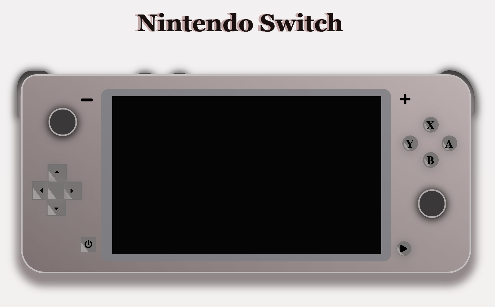

# ¡First Challenge GeeksHubs!

## Introduction
- It consists of emulating the Nintendo Switch console
- Using basic concepts in HTML5 CSS
- And we add functionality with JavaScript

## Languages and Tools
   

## Functions
- [We add animation to the title using CSS, line 12 and 31](css/styles.css)

- [Power button, allows us to view the console, line 1](js/main.js)

- [Play and pause button, we visualize game R-Type Final 2 - Demo Trailer, line 37](js/main.js)

- [Volume button shows us an alert with a maximum volume message, line 51](js/main.js)

## Image

## Proyects
- <a href="https://github.com/2020-JAUG">This is a link to my repositories</a>

    